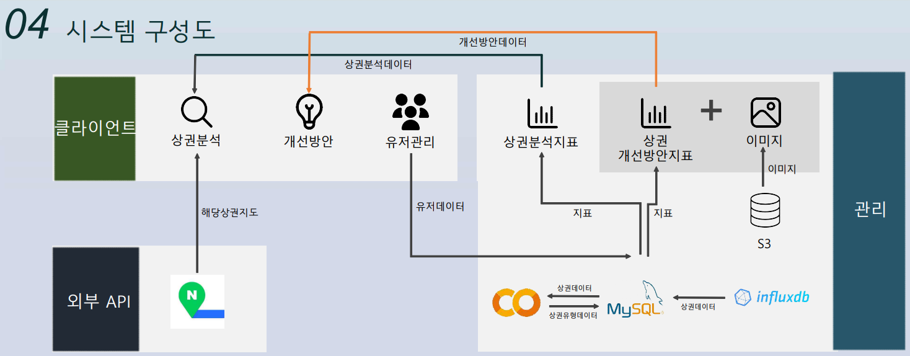

# 🌇 상권 분석 프로젝트 (LG 유플러스 기업 과제)

 

  

 

## 👏 프로젝트 배경

▶️ 기존 상권 분석 로직의 경우 카드 소비액, 점포 수, 매출액 등을 기반으로 상권 분석을 수행함  
▶️ LG 유플러스가 제공하는 유동 인구 데이터를 활용하여 상권 분석 로직을 보완하고 타 서비스와 차별되는 상권 분석 서비스를 만들고자 함
 

## ⭐ 프로젝트 소개

▶️ 유동인구 데이터를 활용해 서울 내에서 상권 군집 유형을 정하는데 유의미한 파생 피처들을 뽑아 클러스터링하여 상권 군집 유형 제시  
▶️ 상권 간의 유형 비교를 통해 유형 변화를 위한 개선 방안 제시  
▶️ 서비스 자체적으로 갖고 있는 파생 피처 데이터들을 바탕으로 사용자가 직접 지표를 커스텀하여 군집 유형을 정하는데 유의미한 데이터인지 파악 가능
 

## ⚒️ 기술 스택

  <h3>Framework</h3>
  
  

  <h3>Database</h3>
  
  
  

  <h3>Infrastructure</h3>
  
  

## 🔃 주요 기능

<h3>✔️ 로그인</h3>

로그인을 통해 회원이 사용할 수 있는 여러 기능들을 사용할 수 있어요.

<h3>✔️ 상권 선택</h3>

서울 지역에 있는 12개의 상권 중 하나를 클릭해주세요.

<h3>✔️ 상권 분석 결과</h3>

선택한 상권에 대한 기본 분석 결과를 제공해요.

<h3>✔️ 상권 상세 분석</h3>

상권 유형을 정하는데 사용한 파생피처와 관련 지표들에 대한 수치를 시각화해서 보여줘요.

<h3>✔️ 비교할 상권 선택</h3>

현재 선택한 상권과 비교할 상권을 선택해주세요.

<h3>✔️ 상권 비교 분석</h3>

상권 간의 주요 차이점을 비교해서 제시해줘요.

<h3>✔️ 개선 방향 제시</h3>

상권의 유형을 변화시키려면 어떤 지표에 주목해야 하고 어떤 방안이 실제로 효과가 있었는지를 제시해줘요.

<h3>✔️ 지표 커스텀</h3>

서비스 내에 갖고 있는 파생 피처 데이터들을 활용해 사용자가 알고 싶어하는 지표 값을 커스텀하여 생성할 수 있어요.

 

## 🚧 아키텍쳐

서비스의 아키텍쳐와 유스케이스 명세서입니다.

 

